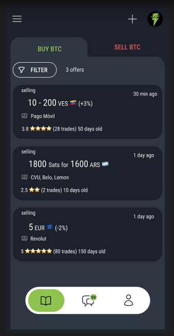

# Mostro mobile

Mostro Mobile is a mobile client for Mostro, currently in development. Its goal is to offer a very intuitive interface designed for all types of users, with a special focus on those with less technical knowledge. The application is designed so that anyone can buy and sell bitcoin P2P without KYC, without even realizing they are using Nostr. The idea is that even grandmothers can use it!

Mostro mobile is a FOSS project; you can visit its [GitHub repository](https://github.com/MostroP2P/mobile) to learn more about its development, report bugs, or propose improvements. Contributions are welcome!
