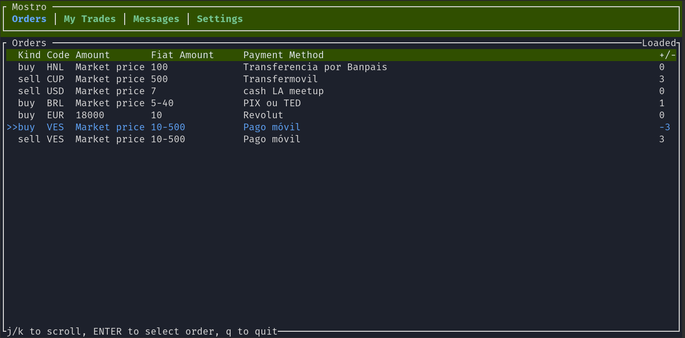

# Mostrui

Mostrui is a Mostro client with a TUI (Terminal User Interface) that offers an enhanced experience in the terminal. It is still in development but is progressing quickly to provide users with a friendly and intuitive experience without needing to write commands, making it an ideal option for both advanced and beginner users.

Mostrui is a FOSS project; you can visit its [GitHub repository](https://github.com/MostroP2P/mostrui) to learn more about its development, report bugs, or propose improvements. Contributions are welcome!
