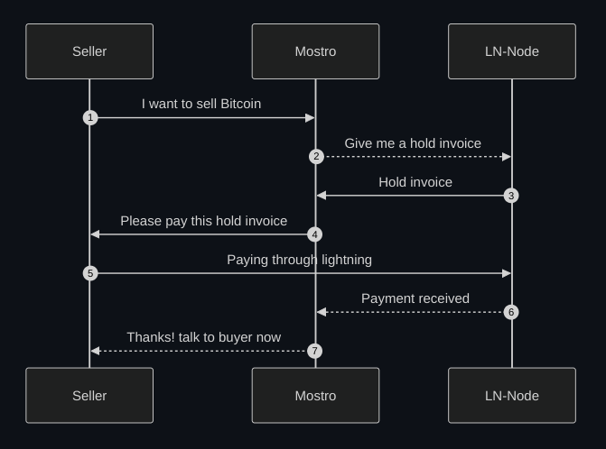

# ¿Cómo funciona Mostro?

Para entender el funcionamiento de Mostro, es importante conocer las partes que lo componen:

- [Mostro daemon (Mostrod)](https://github.com/MostroP2P/mostro): Gestiona la comunicación entre los usuarios y el nodo de Lightning Network (LN). Publica los eventos de Nostr, ejecuta las acciones enviadas por los usuarios y les indica cómo proceder con el intercambio. 

- Nodo de Lightning Network asociado a la instancia de Mostrod: Crea y gestiona las [hold invoices](./hold-invoice.md) que los vendedores deben pagar y efectúa los pagos de las invoices generadas por los compradores.

- [Clientes de Mostro](./clients.md): Son las aplicaciones con las que interactúan directamente los usuarios. Proporcionan la interfaz de comunicación entre Mostrod y los usuarios. Los clientes envían a Mostrod las acciones realizadas por los usuarios, como por ejemplo crear una orden, abrir una disputa, liberar sats, entre otras. Además, son responsables de generar y manejar las claves privadas de los usuarios.

En el siguiente gráfico puedes ver un resumen de cómo interactúan Mostrod, el vendedor (mediante un cliente de Mostro) y el nodo de LN:  

## Flujo de una venta de bitcoin en Mostro

- **Vendedor:** Alice  
- **Comprador:** Bob

1. **Publicación de la orden:**  
   Alice accede a un [Cliente de Mostro](./clients.md) y decide publicar una orden de venta de 5000 Sats por 3 USD, para recibir el pago en su tarjeta XYZ. La interfaz para crear la orden dependerá del [cliente](./clients.md) que use. La orden se publica en un libro de órdenes al que se puede acceder desde cualquier cliente de Mostro. Si en [24 horas](times.md) otro usuario no toma la orden, esta será eliminada automáticamente.

2. **Toma de la orden por el comprador:**  
   Bob, interesado en comprar Sats, accede a un [Cliente de Mostro](./clients.md) (no necesariamente el mismo que utilizó Alice). Encuentra la oferta de 5000 sats por 3 USD y decide tomarla. Entonces, se le solicita que proporcione una invoice por 5000 sats antes de [15 minutos](times.md). Bob genera la invoice en su cartera LN y la envía a Mostro, quien le indica que espere [15 minutos](times.md) mientras su contraparte responde.

3. **Pago y comunicación entre las partes:**  
   Alice recibe un mensaje de Mostro notificando que alguien ha tomado su oferta y que debe pagar una [hold invoice](./hold-invoice.md) por 5000 sats antes de [15 minutos](times.md). Si no realiza el pago, la orden será cancelada. Una vez que Alice paga la factura, Mostro revela la clave pública de Bob a Alice y viceversa, permitiéndoles abrir un chat privado. En este punto, Alice le debe proporcionar a Bob el número de su tarjeta XYZ para recibir el pago en fiat. Cuando Bob le envía los 3 USD, presiona el botón *fiat sent* en su cliente de Mostro. Alice recibe una notificación para verificar la recepción del fiat y luego liberar los Sats a Bob.

4. **Liberación de los Sats:**  
   Cuando Alice verifica que recibió los 3 USD, presiona el botón *release* en su cliente de Mostro. Luego Mostro cobrará los 5000 Sats de la wallet de Alice, y pagará la factura de Bob. Finalmente, Mostro le pedirá a cada uno que califique a su contraparte.
   
Cuando Mostro pone en contacto a los dos usuarios, el tiempo que tienen para finalizar el intercambio está limitado por la duración de la [hold invoice](./hold-invoice.md) que proporciona la instancia de Mostro que estén usando, los usuarios deben respetar ese plazo, para más información al respecto consulta [aquí](times.md).  

Si durante el proceso, Alice y Bob deciden no continuar con el intercambio, pueden [cancelar](./cancelling-an-order.md) la orden de forma cooperativa. Si alguno intenta cancelar arbitrariamente o estafar a la contraparte, el otro puede abrir una [disputa](./disputes.md).

> **Nota:** En este ejemplo, se asume que las tarifas de Mostro son 0. Para más información sobre las tarifas, consulta [Tarifas y Límites de Intercambios](./fees-and-limits.md).

### Explicación técnica

1. **Creación de la orden por parte de Alice:**  
  Cuando Alice crea la oferta de venta, su cliente de Mostro debería generar automáticamente una nueva clave privada de Nostr que Alice usará solo para dicha orden (siempre deben generar una nueva clave privada para cada orden para proteger la [privacidad](./privacy.md) de los usuarios). Usando esa clave, Alice envía a Mostrod un mensaje [NIP-59](https://github.com/nostr-protocol/nips/blob/master/59.md) con los detalles de la orden. Luego, Mostrod publica un [evento reemplazable parametrizado](https://github.com/nostr-protocol/nips/blob/master/01.md#kinds) de tipo 38383, con los detalles de la orden y su estado: `pending`. Los clientes de Mostro monitorean estos eventos y muestran en sus libros de órdenes aquellas órdenes con estado `pending`.

2. **Toma de la orden por Bob:**  
   Cuando Bob toma la orden, su cliente de Mostro debe generarle automáticamente una nueva clave privada de Nostr para esta orden, luego envía un mensaje [NIP-59](https://github.com/nostr-protocol/nips/blob/master/59.md) a Mostrod indicando que ha tomado esa oferta. Mostrod publica un nuevo evento 38383 para esa orden, esta vez con el estado `waiting-buyer-invoice` lo que elimina la orden de los libros de ofertas de todos los clientes, ya que no está `pending`. Mostrod le envía a Bob un mensaje [NIP-59](https://github.com/nostr-protocol/nips/blob/master/59.md) solicitando una invoice por 5000 Sats. Bob envía la invoice a Mostrod en un mensaje [NIP-59](https://github.com/nostr-protocol/nips/blob/master/59.md) y luego Mostrod publicará un evento 38383 para esa orden, esta vez con el estado `waiting-payment`.

3. **Pago de la hold invoice por Alice:**  
   Mostrod envía a Alice un mensaje [NIP-59](https://github.com/nostr-protocol/nips/blob/master/59.md) con la [hold invoice](./hold-invoice.md) generada por el nodo LN asociado. Si Alice paga dentro de los 15 minutos, Mostro le envía un mensaje [NIP-59](https://github.com/nostr-protocol/nips/blob/master/59.md) revelando la pubkey de Bob, y otro mensaje a Bob revelando la pubkey de Alice. Además, actualiza el evento 38383 para esta orden con el estado `active`. Ahora, Alice y Bob pueden comunicarse directamente a través de mensajes cifrados con el algoritmo [NIP-44](https://github.com/nostr-protocol/nips/blob/master/44.md), Mostrod no recibe ninguno de esos mensajes. Cuando Bob realiza el pago del fiat y presiona *fiat sent* en su cliente, envía un mensaje [NIP-59](https://github.com/nostr-protocol/nips/blob/master/59.md) con la acción `fiat-sent` a Mostrod, quien a su vez le enviará un mensaje [NIP-59](https://github.com/nostr-protocol/nips/blob/master/59.md) a Alice con esa misma acción y su cliente le mostrará un botón de *release* para liberar los Sats si ya recibió el pago. Mostrod también publicará un evento 38383 para esa orden, esta vez con el estado `fiat-sent`.
   
4. **Liberación de los Sats por Alice:**  
   Cuando Alice presiona el botón *release* en su cliente, le envía un mensaje [NIP-59](https://github.com/nostr-protocol/nips/blob/master/59.md) a Mostrod indicando que libere los Sats a Bob. Entonces, el nodo de LN asociado a esa instancia de Mostrod liquida el pago de la [hold invoice](./hold-invoice.md) y paga la invoice que proporcionó Bob. Al finalizar el proceso, Mostrod publica un evento 38383 para esa orden con el estado `success` y le envía un mensaje [NIP-59](https://github.com/nostr-protocol/nips/blob/master/59.md) a Alice y Bob, solicitando que califiquen a su contraparte, quienes le envían de vuelta su calificación a través de un mensaje [NIP-59](https://github.com/nostr-protocol/nips/blob/master/59.md).
   
Para tener más detalles de la comunicación entre Mostrod y sus clientes, puedes leer [aquí](https://mostro.network/messages).
