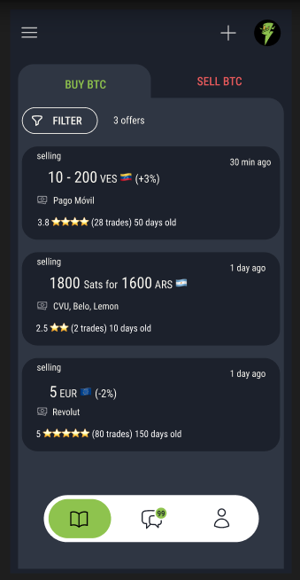

# Mostro mobile

Mostro Mobile es un cliente móvil de Mostro, actualmente en desarrollo. Su objetivo es ofrecer una interfaz muy intuitiva, pensada para todo tipo de usuario, con un enfoque especial en aquellos con menos conocimientos técnicos. La aplicación está diseñada para que cualquiera pueda comprar y vender bitcoin p2p sin KYC, sin siquiera darse cuenta de que está utilizando Nostr. ¡La idea es que hasta las abuelas puedan usarlo!

Mostro mobile es un proyecto FOSS, puedes visitar su [repositorio](https://github.com/MostroP2P/mobile) para conocer más sobre su desarrollo, reportar bugs, o proponer mejoras. ¡Las colaboraciones son bienvenidas!
