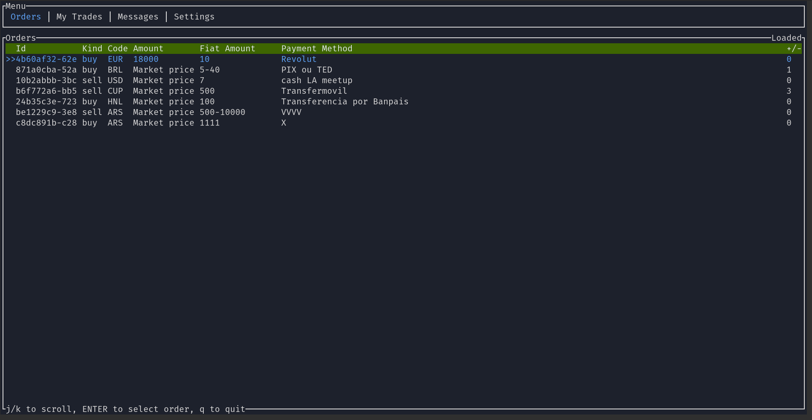

# Mostrui

Mostrui es un cliente de Mostro con interfaz TUI (Terminal User Interface) que ofrece una experiencia mejorada en la terminal. Aún está en desarrollo, avanza rápidamente para para brindar a los usuarios una experiencia amigable e intuitiva sin la necesidad escribir comandos, lo que lo convertirá en una opción ideal tanto para usuarios avanzados como principiantes.

Mostrui es un proyecto FOSS, puedes visitar su [repositorio](https://github.com/MostroP2P/mostrui) para conocer más sobre su desarrollo, reportar bugs, o proponer mejoras. ¡Las colaboraciones son bienvenidas!

