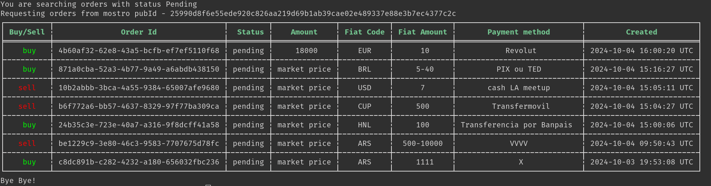

# Mostro-cli

Mostro-cli is a Mostro client with a command-line interface, primarily used by developers and advanced users to test the latest functionalities of Mostrod.

Mostro-cli is a FOSS project; you can visit its [GitHub repository](https://github.com/MostroP2P/mostro-cli) to learn more about its development, report bugs, or propose improvements. Contributions are welcome!
