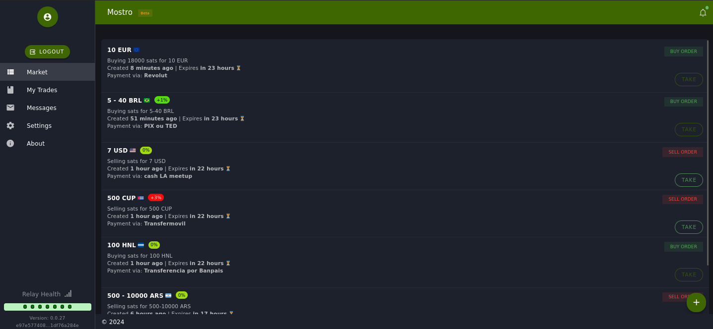

# Mostro-web

Mostro-web is a Mostro client with a web interface that you can access via: [https://app.mostro.network](https://app.mostro.network) and [https://mostro.bilthon.dev](https://mostro.bilthon.dev).

The interface is very intuitive, so if you're not a technical user, this is currently the best way to interact with Mostro. It is compatible with browser extensions that support the NIP-07 standard, but you can also generate new keys whenever you wish.

**Tip:** If you use it from a mobile device, we recommend enabling desktop mode in your browser to improve the user experience, especially when viewing action buttons.

Mostro-web is a FOSS project; you can visit its [GitHub repository](https://github.com/MostroP2P/mostro-web) to learn more about its development, report bugs, or propose improvements. Contributions are welcome!
