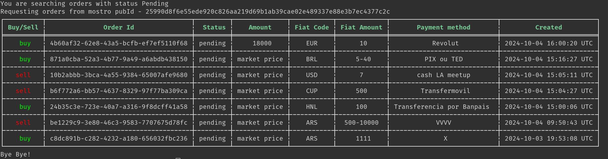

# Mostro-cli

Mostro-cli es un cliente de Mostro con interfaz de línea de comandos, es utilizado mayormente por desarrolladores y usuarios avanzados para probar las últimas funcionalidades de Mostrod.

Mostro-cli es un proyecto FOSS, puedes visitar su [repositorio en GitHub](https://github.com/MostroP2P/mostro-cli) para conocer más sobre su desarrollo, reportar bugs, o proponer mejoras. ¡Las colaboraciones son bienvenidas!
