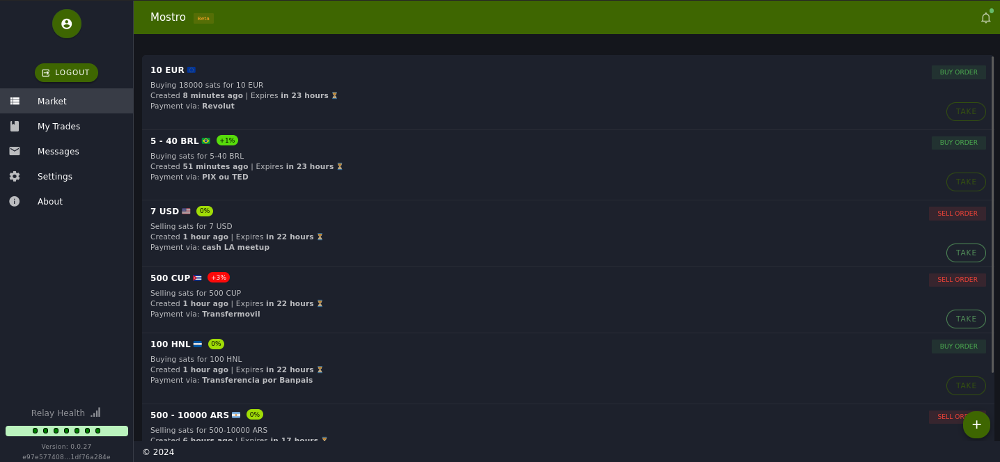

# Mostro-web

Mostro-web es un cliente de Mostro con interfaz web al que puedes acceder a través de: [https://app.mostro.network](https://app.mostro.network) y por [https://mostro.bilthon.dev](https://mostro.bilthon.dev).

La interfaz es muy intuitiva, por lo que si no eres un usuario técnico, actualmente esta es la mejor manera de interactuar con Mostro.
Es compatible con extensiones de navegador que admiten el estándar NIP-07, pero también puedes generar claves nuevas cada vez que lo desees. 

**Tip:** Si lo usas desde un dispositivo móvil, te recomendamos activar el modo de escritorio en tu navegador para mejorar la experiencia de usuario, especialmente al visualizar los botones de acción.

Mostro-web es un proyecto FOSS, puedes visitar su [repositorio en Github](https://github.com/MostroP2P/mostro-web) para conocer más sobre su desarrollo, reportar bugs, o proponer mejoras. ¡Las colaboraciones son bienvenidas!
